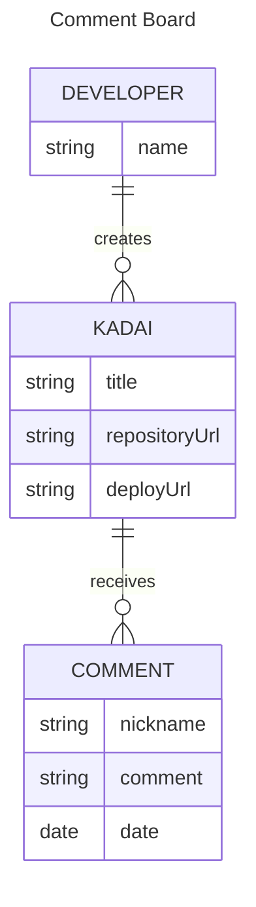

```mermaid

---
title: Comment Board
---
erDiagram
    DEVELOPER ||--o{ KADAI: creates
    DEVELOPER{
      string name
    }

    KADAI ||--o{ COMMENT : receives
    KADAI {
      string title
      string repositoryUrl
      string deployUrl
    }

    COMMENT {
      string nickname
      string comment
      date date
    }

```
